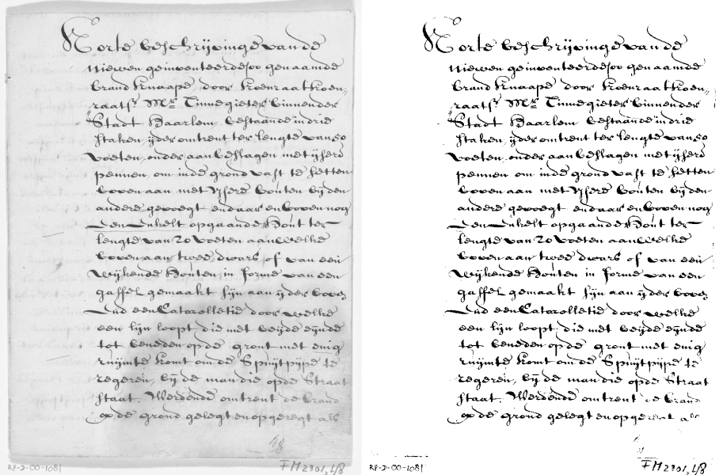

# image.binarization

This repository contains an R package for Binarizing Images focusing on local adaptive thresholding with the purpose of improving

- Optical Character Recognition (OCR)
- Handwritten Text Recognition (HTR)

### Installation

- For regular users, install the package from your local CRAN mirror `install.packages("image.binarization")`
- For installing the development version of this package: `remotes::install_github("DIGI-VUB/image.binarization")`
- Note that the package requires a compiler with C++17 capabilities

Look to the documentation of the functions

```
help(package = "image.binarization")
```

## Example

Get an image, put it into gray scale and binarise it using the method by `Su`

```{r}
library(magick)
library(image.binarization)
img <- image_read("scan.jpg")
img <- image_convert(img, format = "PGM", colorspace = "Gray")
img
img <- image_binarization(img, type = "su")
img
```



## Algorithms

* Otsu - "A threshold selection method from gray-level histograms", 1979.
* Bernsen - "Dynamic thresholding of gray-level images", 1986.
* Niblack - "An Introduction to Digital Image Processing", 1986.
* Sauvola - "Adaptive document image binarization", 1999.
* Wolf - "Extraction and Recognition of Artificial Text in Multimedia Documents", 2003.
* Gatos - "Adaptive degraded document image binarization", 2005. (Partial)
* NICK - "Comparison of Niblack inspired Binarization methods for ancient documents", 2009.
* Su - "Binarization of Historical Document Images Using the Local Maximum and Minimum", 2010.
* T.R. Singh - "A New local Adaptive Thresholding Technique in Binarization", 2011.
* Bataineh - "An adaptive local binarization method for document images based on a novel thresholding method and dynamic windows", 2011. (unreproducible)
* ISauvola - "ISauvola: Improved Sauvola’s Algorithm for Document Image Binarization", 2016.
* WAN - "Binarization of Document Image Using Optimum Threshold Modification", 2018.

Based on https://github.com/brandonmpetty/Doxa

### DIGI

By DIGI: Brussels Platform for Digital Humanities: https://digi.research.vub.be


